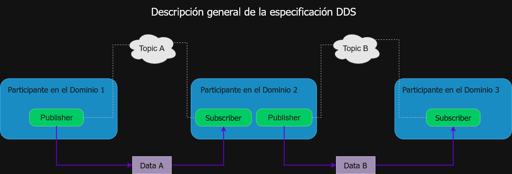

"Este material fue desarrollado con el apoyo del PAPIME PE110923 de la UNAM."

# DDS (Data Distribution Service)

En **ROS 2 (Robot Operating System 2)**, la comunicación entre nodos es un aspecto fundamental para el desarrollo de aplicaciones robóticas distribuidas y escalables. Para gestionar esta comunicación, ROS 2 utiliza **DDS (Data Distribution Service)**, un estándar que permite la transmisión eficiente y confiable de datos en sistemas distribuidos.  

Este enfoque descentralizado mejora la escalabilidad, seguridad y flexibilidad en comparación con ROS 1, que dependía de un nodo maestro (*roscore*).  

## ¿Qué es DDS?

### Definición de DDS

**DDS (Data Distribution Service)** es un estándar de middleware desarrollado por la **Object Management Group (OMG)** que define un modelo de comunicación **publicador-suscriptor** para el intercambio de datos en sistemas distribuidos.  

DDS facilita la comunicación entre múltiples procesos sin requerir una conexión punto a punto explícita, permitiendo que los dispositivos intercambien información de manera eficiente y en tiempo real.  

## Propósito de DDS

**DDS** fue diseñado para proporcionar una solución robusta y flexible para la **comunicación de datos en sistemas distribuidos**, incluyendo aplicaciones en robótica, sistemas industriales, automoción, telecomunicaciones y entornos críticos como la aviación y la medicina.  

### Objetivos principales de DDS en ROS 2

- **Comunicación descentralizada:** No necesita un servidor central, permitiendo que los nodos se descubran y comuniquen automáticamente.  
- **Baja latencia y alta eficiencia:** Optimizado para sistemas en tiempo real y grandes volúmenes de datos.  
- **Fiabilidad y calidad de servicio (QoS):** Permite configurar parámetros como entrega garantizada, latencia y prioridad de los mensajes.  
- **Escalabilidad:** Soporta la integración de múltiples robots y dispositivos conectados en la misma red.  
- **Soporte para entornos distribuidos:** Permite que nodos ubicados en distintas máquinas se comuniquen eficientemente.  
- **Ejemplo de uso en robótica:** Un robot móvil con múltiples sensores y actuadores necesita transmitir datos entre nodos de percepción, planificación y control en tiempo real. DDS garantiza que la información fluya de manera eficiente sin depender de un nodo central.  

### Características Claves de DDS en ROS 2

- **Modelo Publicador-Suscriptor**  
   - Un nodo **publicador** envía datos a un **tópico**.  
   - Uno o más **suscriptores** pueden recibir esos datos si están suscritos al mismo tópico.  

- **Calidad de Servicio (QoS)**  
   - DDS permite ajustar la **latencia, confiabilidad y persistencia** de los mensajes.  
   - Por ejemplo, una cámara de un robot puede requerir **baja latencia**, mientras que un registro de eventos necesita **almacenar datos incluso si un nodo está desconectado temporalmente**.  

- **Descubrimiento Automático**  
   - Los nodos encuentran y establecen comunicación sin configuraciones manuales.  
   - No necesita un servidor central, eliminando puntos de fallo únicos.  

- **Compatibilidad con Múltiples Implementaciones**  
   - ROS 2 soporta varias implementaciones de DDS, como:  
     - **Fast DDS** (open-source, rendimiento equilibrado).  
     - **Cyclone DDS** (optimizado para baja latencia).  
     - **RTI Connext DDS** (versión comercial con alto rendimiento).  
     - **OpenSplice DDS** (orientado a entornos industriales).  
- **Ejemplo de Funcionamiento en ROS 2:**  
    - Un nodo de sensores publica datos en el tópico `/laser_scan`.  
    - Un nodo de navegación se suscribe a `/laser_scan` y usa los datos para evitar obstáculos.  
    - Otro nodo de monitoreo también se suscribe a `/laser_scan` para visualizar los datos en una interfaz gráfica.  
    - DDS gestiona la entrega de datos entre estos nodos con la configuración óptima de **QoS** según las necesidades de cada uno.  

