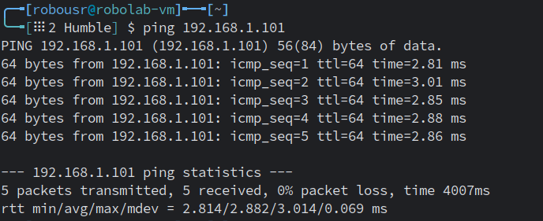
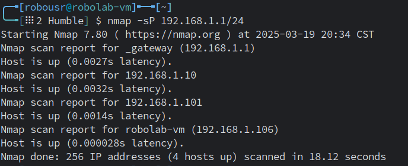

# Herramientas para el Análisis de Red en ROS 2

En **ROS 2**, la comunicación entre nodos depende de una red correctamente configurada. Para garantizar una conexión estable y solucionar problemas de comunicación, se pueden utilizar varias herramientas de análisis de red. A continuación, se presentan herramientas y comandos útiles para monitorear y diagnosticar la conectividad en una red local.  

## Verificación de Interfaces de Red con `ip`

El comando `ip a` o `ip address` muestra las interfaces de red disponibles y sus direcciones IP asignadas.  

```bash
ip a
```
**Ejemplo de salida en una computadora con conexión Ethernet (`eth0`)**:

```
2: eth0: <UP,BROADCAST,RUNNING,MULTICAST> mtu 1500 qdisc fq_codel state UP 
    link/ether 00:1a:2b:3c:4d:5e brd ff:ff:ff:ff:ff:ff
    inet 192.168.0.10/24 brd 192.168.0.255 scope global dynamic eth0
```

**En una Máquina Virtual (VM), la interfaz puede aparecer como `ens33` en lugar de `eth0`**:

```
2: ens33: <UP,BROADCAST,RUNNING,MULTICAST> mtu 1500 qdisc fq_codel state UP 
    link/ether 00:1a:2b:3c:4d:5e brd ff:ff:ff:ff:ff:ff
    inet 192.168.0.20/24 brd 192.168.0.255 scope global dynamic ens33
```
**Importancia en ROS 2**: Asegurarse de que la interfaz de red correcta esté activa y tenga una dirección en la subred esperada.


## Comprobación de Conectividad con `ping`

El comando `ping` se usa para verificar si un dispositivo en la red responde.

```bash
ping 192.168.0.1
```

**Ejemplo de salida si la conexión es exitosa**:

```
64 bytes from 192.168.0.1: icmp_seq=1 ttl=64 time=0.5 ms
64 bytes from 192.168.0.1: icmp_seq=2 ttl=64 time=0.6 ms
```

**Ejemplo si no hay respuesta**:
```
Request timeout for icmp_seq 1
```

**Importancia en ROS 2**: Si un nodo ROS 2 no responde al `ping`, es posible que haya problemas de red o firewalls bloqueando la comunicación.  



Para más información para interpretar la salida del comando, consultar la siguiente referencia [_"How to Check an IP Address Using the IP Command with Output Explanation"_](https://samuel-ricky.medium.com/how-to-interpret-the-output-of-ip-addr-show-8008c7c41dde).

## Pruebas de Comunicación con `netcat`

`netcat` (o `nc`) permite probar la comunicación entre dos dispositivos mediante TCP o UDP.

**Ejemplo de prueba de conexión en un nodo (modo escucha en el puerto 8888)**:

```bash
nc -l 8888
```

**En otro nodo, enviar un mensaje a la IP 192.168.0.10**:
```bash
echo "Hola ROS 2" | nc 192.168.0.10 8888
```

**Salida esperada en el nodo receptor**:
```
Hola ROS 2
```

**Importancia en ROS 2**: Confirma que los nodos pueden intercambiar datos en un puerto específico.  

## Descubrimiento de Dispositivos en la Red con `nmap -sP`

Para encontrar dispositivos conectados en la red, se puede usar `nmap`.

```bash
nmap -sP 192.168.0.0/24
```

**Ejemplo de salida**:

```
Starting Nmap...
Nmap scan report for 192.168.0.1 (Router)
Nmap scan report for 192.168.0.10 (Robot)
Nmap scan report for 192.168.0.20 (Laptop)
```

**Importancia en ROS 2**: Verifica qué dispositivos están activos y si un nodo específico está en la red.



## Medición del Ancho de Banda con `iperf3`

`iperf3` permite evaluar la velocidad de la red entre dos nodos.  

**En un nodo, ejecutar como servidor**:

```bash
iperf3 -s
```

**En otro nodo, ejecutar como cliente apuntando a la IP del servidor**:

```bash
iperf3 -c 192.168.0.10
```

**Ejemplo de salida**:
```
[ ID] Interval       Transfer     Bandwidth
[  4]  0.0-10.0 sec  112 MBytes  94.1 Mbits/sec
```

**Importancia en ROS 2**: Permite evaluar si la red tiene el **ancho de banda suficiente** para transmitir datos como imágenes o mapas en tiempo real.  

## Análisis de Tráfico con Wireshark

`Wireshark` es una herramienta gráfica para capturar y analizar paquetes de red.  

**Ejemplo de comando para capturar tráfico en la interfaz `eth0`**:

```bash
sudo wireshark
```

**Filtrar tráfico de ROS 2 (DDS/RTPS)** en la barra de búsqueda:

```
rtps
```

**Importancia en ROS 2**: Permite analizar el tráfico de nodos ROS 2 y diagnosticar problemas de comunicación, como paquetes perdidos o retrasos en la transmisión.  

**Resumen de herramientas clave:**

Para garantizar la correcta comunicación en **ROS 2**, es fundamental usar herramientas de análisis de red para **verificar conectividad, medir ancho de banda y solucionar problemas de transmisión de datos**.  

| **Herramienta** | **Propósito** |
|---------------|-------------|
| `ip a` | Verificar interfaces de red y direcciones IP. |
| `ping` | Comprobar conectividad entre nodos. |
| `netcat (nc)` | Probar transmisión de datos en un puerto específico. |
| `nmap -sP` | Descubrir dispositivos en la red. |
| `iperf3` | Medir el ancho de banda disponible. |
| `Wireshark` | Analizar el tráfico de ROS 2 en la red. |

Siguiendo estas herramientas, se pueden diagnosticar y solucionar problemas de comunicación en **ROS 2** dentro de una red local.
