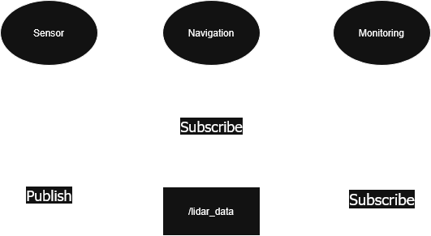

# ROS 2: Comunicaciones de Red (Networking)

Uno de los aspectos más importantes en **ROS 2** es su sistema de **comunicaciones de red**, el cual permite la interacción entre nodos distribuidos en diferentes dispositivos o computadoras, facilitando la construcción de sistemas robóticos modulares y flexibles.  

## Arquitectura de Comunicaciones en ROS 2

La arquitectura de comunicaciones en **ROS 2** está diseñada para proporcionar una comunicación eficiente, escalable y descentralizada entre nodos dentro de un sistema robótico. A diferencia de **ROS 1**, donde los nodos dependían de un maestro central (*roscore*) para coordinar la comunicación, ROS 2 implementa un modelo basado en el estándar **DDS (Data Distribution Service)**, que permite una comunicación distribuida sin un único punto de fallo.  

### Modelo de Comunicación en ROS 2

ROS 2 soporta diferentes paradigmas de comunicación para cubrir diversas necesidades en sistemas robóticos:  

1. Comunicación basada en Tópicos (Publicador-Suscriptor) 
Este es el modelo más común en ROS 2, basado en el principio de **publicadores** y **suscriptores**:  
    - Un **nodo publicador** envía mensajes a un **tópico** determinado.  
    - Uno o varios **nodos suscriptores** reciben los mensajes publicados en ese tópico.  
    - **Ejemplo de uso**:  
    Un robot móvil puede tener un nodo de sensores LIDAR que publica datos en el tópico `/scan`, y otro nodo de procesamiento que se suscribe a ese tópico para analizar los datos.  

    Esta arquitectura es eficiente porque permite a múltiples nodos recibir información sin que el publicador tenga que conocer la identidad de los suscriptores.  

1. Comunicación basada en Servicios (Cliente-Servidor)
Algunas aplicaciones requieren un esquema de **solicitud y respuesta**, donde un nodo puede pedir información o realizar una acción en otro nodo.  
    - Un nodo **cliente** envía una solicitud a un nodo **servidor**.  
    - El nodo servidor procesa la solicitud y envía una respuesta al cliente.  
    - **Ejemplo de uso**
    Un brazo robótico tiene un nodo servidor que controla su movimiento. Un nodo cliente puede enviar una solicitud de servicio para mover el brazo a una posición específica.  

    Este modelo es útil cuando se necesita una interacción síncrona, pero puede no ser adecuado para tareas que requieren un flujo continuo de datos.  

1. Comunicación basada en Acciones (Action Server-Client)
Las **acciones** son una extensión del modelo cliente-servidor y están diseñadas para tareas que pueden tomar tiempo en completarse.  
    - Un **nodo cliente** envía una solicitud de acción a un **nodo servidor de acciones**.  
    - El servidor ejecuta la tarea en segundo plano y envía actualizaciones periódicas sobre el progreso.  
    - El cliente puede cancelar la acción en cualquier momento.  
    - **Ejemplo de uso**
    Un robot móvil que recibe una orden para navegar a un punto específico puede utilizar una acción para actualizar su progreso a lo largo del trayecto.  

    Las acciones son ideales para tareas largas donde el cliente necesita monitorear la evolución del proceso.  

1. Comunicación basada en Parámetros
ROS 2 también permite que los nodos almacenen y compartan configuraciones a través del sistema de **parámetros**.  
    - Un nodo puede definir parámetros que otros nodos pueden leer o modificar.  
    - Los parámetros pueden ser usados para ajustar configuraciones dinámicamente sin necesidad de reiniciar el nodo.  
    - **Ejemplo de uso**
    Un nodo de control de velocidad de un robot puede tener un parámetro `max_speed` que puede ser modificado sin detener la ejecución del sistema.  

### Implementación de DDS en ROS 2

[**DDS (Data Distribution Service)**](DDS.md) es el núcleo del sistema de comunicación en ROS 2. Este middleware gestiona el transporte de datos entre nodos y permite una comunicación eficiente en redes distribuidas.  

1. Características de DDS en ROS 2
    - **Comunicación descentralizada:** No requiere un nodo maestro, lo que reduce puntos de fallo.  
    - **Escalabilidad:** Compatible con sistemas multi-robot y redes en la nube.  
    - **Configuración de QoS (Calidad de Servicio):** Permite ajustar fiabilidad, latencia y persistencia de datos.  
    - **Descubrimiento automático:** Los nodos encuentran a otros sin necesidad de configuraciones manuales.  
1. Implementaciones de DDS compatibles con ROS 2
ROS 2 soporta diferentes proveedores de DDS, cada uno con sus propias optimizaciones:  
    - **Fast DDS** (open-source, rendimiento equilibrado)  
    - **Cyclone DDS** (optimizado para latencia baja)  
    - **RTI Connext DDS** (versión comercial con alto rendimiento)  
    - **OpenSplice DDS** (orientado a sistemas industriales)  

    Dependiendo de la aplicación, se puede elegir la implementación que mejor se adapte a las necesidades del sistema robótico.  

### Configuración de Redes en ROS 2

1. Configuración de **ROS_DOMAIN_ID**
    - ROS 2 permite definir **dominios DDS** mediante la variable de entorno `ROS_DOMAIN_ID`. Esto permite aislar diferentes instancias de ROS 2 en la misma red.  
    - **Ejemplo**
        ```bash
        export ROS_DOMAIN_ID=1
        ```
    Si dos sistemas ROS 2 tienen el mismo `ROS_DOMAIN_ID`, podrán comunicarse entre sí.  

1. Configuración de [**QoS** (Quality of Service, Calidad de Servicio)](QoS.md)
    - DDS permite personalizar la **calidad de servicio (QoS)** en la comunicación de ROS 2. Algunos de los parámetros más importantes son:
    - **Reliability (Fiabilidad)**  
        - `RELIABLE`: Garantiza que todos los mensajes lleguen correctamente.
        - `BEST_EFFORT`: Enfocado en velocidad, pero sin garantía de entrega.
    - **History (Historial de mensajes)**  
        - `KEEP_LAST(N)`: Mantiene solo los últimos N mensajes.
        - `KEEP_ALL`: Almacena todos los mensajes en el buffer.
    - **Durability (Persistencia de datos)**  
        - `VOLATILE`: Los mensajes solo están disponibles en tiempo real.
        - `TRANSIENT_LOCAL`: Mantiene los mensajes para nuevos suscriptores.

    Configurando correctamente estos parámetros, se puede optimizar la comunicación según los requisitos del sistema.  

1. Comunicación en Sistemas Distribuidos
    - ROS 2 permite la ejecución de nodos en múltiples computadoras interconectadas por una red. Para que la comunicación funcione en entornos distribuidos, se deben considerar aspectos como:  
        - **Configuración de direcciones IP:** Los nodos deben poder encontrarse en la red.  
        - **Firewalls y puertos abiertos:** ROS 2 usa puertos dinámicos que deben estar accesibles.  
        - **Soporte para comunicación en la nube:** Se pueden usar VPNs o configuraciones avanzadas de DDS para permitir comunicación remota.  

## Transporte de Datos en ROS 2

El transporte de datos en **ROS 2** es un aspecto fundamental que permite la comunicación eficiente y confiable entre nodos en un sistema robótico. Gracias a la adopción del estándar **DDS (Data Distribution Service)**, ROS 2 ofrece una infraestructura de transporte de datos flexible que se adapta a diferentes necesidades, desde sistemas embebidos hasta arquitecturas en la nube.  

### Modelo de Transporte de Datos en ROS 2

ROS 2 permite la comunicación entre nodos utilizando **diferentes protocolos de transporte**, optimizados para diversas aplicaciones:  

- **Transporte basado en UDP y Multicast**: Para comunicación rápida en redes locales.  
- **Transporte basado en TCP**: Para conexiones más confiables, especialmente en redes distribuidas.  
- **Memoria compartida (Shared Memory - SHM)**: Para una transmisión eficiente entre nodos en el mismo sistema.  

Cada uno de estos métodos tiene ventajas y desventajas dependiendo del caso de uso.  

### Protocolos de Transporte en ROS 2

1. Transporte basado en UDP
    - **UDP (User Datagram Protocol)** es un protocolo rápido y liviano que **no garantiza** la entrega de los datos ni su orden. Sin embargo, su baja latencia lo hace ideal para aplicaciones en tiempo real.
    - Ventajas:  
        - Bajo consumo de ancho de banda.  
        - Permite comunicación en tiempo real.  
        - Compatible con sistemas de transmisión de datos en redes locales.  
    - Desventajas:  
        - No garantiza la entrega de paquetes.  
        - Puede generar pérdida de datos en redes inestables.  
    - **Uso en ROS 2**:
    El transporte basado en UDP es útil en aplicaciones como el envío de datos de sensores LIDAR o cámaras de alta velocidad, donde la rapidez es más importante que la confiabilidad absoluta.  

1. Transporte basado en Multicast
    - **Multicast** permite la comunicación de un nodo con múltiples suscriptores sin necesidad de enviar múltiples copias del mismo mensaje, lo que mejora la eficiencia en redes locales.  
    - Ventajas:  
        - Permite enviar un solo paquete a múltiples destinatarios.  
        - Reduce la carga de la red al evitar duplicación de datos.  
    - Desventajas:  
        - No está soportado en todas las redes ni en todas las configuraciones de DDS.  
        - Puede ser bloqueado por firewalls y routers.  
    - **Uso en ROS 2**:  
    Multicast es útil en redes locales cuando varios nodos deben recibir la misma información, por ejemplo, en un sistema multi-robot donde cada robot recibe datos de estado de un servidor central.  

1. Transporte basado en TCP
    - **TCP (Transmission Control Protocol)** es un protocolo **orientado a conexión** que garantiza la entrega de los datos y mantiene el orden de los paquetes.  
    - Ventajas:  
        - Asegura que los datos lleguen en el orden correcto.  
        - Es más confiable para la comunicación en redes públicas o distribuidas.  
    - Desventajas:  
        - Introduce mayor latencia debido a su mecanismo de confirmación de entrega.  
        - Puede ser más pesado en términos de uso de ancho de banda.  
    - **Uso en ROS 2**:  
    TCP es útil cuando se necesita una comunicación confiable, como en la transmisión de comandos de control remoto o la comunicación entre robots y servidores en la nube.  

1. Memoria Compartida (Shared Memory - SHM)
    - **Shared Memory** permite que los nodos intercambien datos directamente en la memoria del sistema, evitando el uso de la red.  
    - Ventajas:  
        - Máxima velocidad de transmisión de datos.  
        - Uso eficiente de los recursos del sistema.  
    - Desventajas:  
        - Solo funciona en nodos dentro de la misma máquina.  
        - Puede ser más complejo de configurar en comparación con otros métodos.  
    - **Uso en ROS 2**:  
    La memoria compartida es ideal para aplicaciones en las que varios nodos en la misma computadora deben intercambiar datos a alta velocidad, como en sistemas de percepción y planificación de movimiento.  

### Implementaciones DDS y Transporte de Datos

ROS 2 permite elegir entre diferentes implementaciones de **DDS** (*Data Distribution Service*), cada una con sus optimizaciones para transporte de datos:

| Implementación DDS  | Características de Transporte de Datos |
|---------------------|--------------------------------------|
| **Fast DDS**       | Soporte para UDP y Multicast, optimizado para robots móviles. |
| **Cyclone DDS**    | Baja latencia, eficiente en redes locales. |
| **RTI Connext DDS** | Soporta TCP y UDP, utilizado en aplicaciones industriales. |
| **OpenSplice DDS**  | Optimizado para sistemas críticos y embebidos. |

Cada implementación ofrece opciones para ajustar el **rendimiento del transporte de datos**, permitiendo optimizar el sistema según los requerimientos del robot.  

### Configuración de Transporte de Datos en ROS 2

Para optimizar el transporte de datos en ROS 2, se pueden modificar los siguientes parámetros:

1. Configuración de **QoS (Calidad de Servicio)**  
DDS permite definir políticas de **Calidad de Servicio (QoS)** que afectan cómo se transmiten los datos. Algunos de los más importantes son:  
    - **Reliability (Fiabilidad):**  
        - `BEST_EFFORT`: Usa UDP para minimizar la latencia.  
        - `RELIABLE`: Usa TCP para garantizar la entrega de los datos.  
    - **History (Historial de Mensajes):**  
        - `KEEP_LAST(N)`: Mantiene los últimos N mensajes en el buffer.  
        - `KEEP_ALL`: Almacena todos los mensajes disponibles.  
    - **Durability (Persistencia de Datos):**  
        - `VOLATILE`: Los datos no se almacenan y solo existen en el momento de transmisión.  
        - `TRANSIENT_LOCAL`: Los datos persisten para nuevos suscriptores.  

    Ejemplo de configuración de QoS en Python:  
    ```python
    from rclpy.qos import QoSProfile, ReliabilityPolicy

    qos_profile = QoSProfile(
        reliability=ReliabilityPolicy.RELIABLE,
        depth=10
    )
    ```
1. Configuración de Transportes DDS
    - Se pueden modificar las opciones de transporte en los archivos de configuración de DDS.  
    - Ejemplo de configuración de **Fast DDS** para usar UDP en lugar de TCP:  
        ```xml
        <transport_descriptors>
            <transport_descriptor>
                <transport_id>udp_transport</transport_id>
                <type>UDPv4</type>
            </transport_descriptor>
        </transport_descriptors>
        ```
        Esto mejora el rendimiento en redes locales al evitar la sobrecarga de TCP.  

### Comunicación Distribuida en ROS 2

La comunicación distribuida en **ROS 2** permite la interacción entre múltiples nodos ejecutándose en diferentes dispositivos dentro de una red. A diferencia de **ROS 1**, donde todos los nodos dependían de un maestro central (***roscore***), **ROS 2** utiliza el estándar **DDS (Data Distribution Service)**, el cual facilita la comunicación descentralizada, escalable y robusta en redes heterogéneas.

Esta arquitectura distribuida permite la implementación de **sistemas multi-robot**, integración con **servicios en la nube** y ejecución de **nodos en múltiples dispositivos** dentro de una misma red.

#### Características de la Comunicación Distribuida en ROS 2

1. Comunicación Descentralizada

    En ROS 2, los nodos se comunican directamente entre sí sin necesidad de un nodo maestro centralizado. Esto ofrece múltiples ventajas:  
    - **Menor punto de fallo**: No hay dependencia de un único servidor central.
    - **Mayor escalabilidad**: Se pueden conectar múltiples dispositivos sin afectar el rendimiento.
    - **Mayor flexibilidad**: Los nodos pueden entrar y salir dinámicamente de la red sin afectar el sistema global.
    - **Ejemplo de aplicación**: Un sistema con múltiples drones operando en la misma red, donde cada dron tiene nodos independientes que intercambian datos con otros drones sin requerir un servidor central.

1. Descubrimiento Automático de Nodos

    Uno de los beneficios de **DDS** en ROS 2 es que los nodos pueden **descubrirse automáticamente** dentro de la red. Cuando un nodo inicia, **se anuncia** a otros nodos en el mismo dominio DDS y establece conexiones de manera dinámica.  
    - **Mecanismo de Descubrimiento:**
        - Cada nodo envía mensajes de "anuncio" en la red.  
        - Los nodos vecinos reciben estos mensajes y almacenan información sobre los nuevos participantes.  
        - Se establecen conexiones de comunicación automáticamente.  

        Este mecanismo elimina la necesidad de una configuración manual extensa y permite una rápida integración de nuevos nodos.  

    - **Ejemplo de aplicación**: En una flota de robots autónomos, al agregar un nuevo robot a la red, este automáticamente detecta y se conecta con otros robots sin intervención manual.

1. Compatibilidad con Redes Locales y Globales
ROS 2 está diseñado para operar tanto en redes locales (LAN) como en redes de área amplia (WAN) o en la nube.

    **En redes locales (LAN):**  
    - Bajo tiempo de latencia.  
    - Uso eficiente del ancho de banda.  
    - Fácil descubrimiento de nodos mediante multicast.  

    **En redes distribuidas o en la nube (WAN):**  
    - Se requieren configuraciones específicas en DDS para garantizar la conectividad.  
    - Se pueden usar túneles VPN o NAT traversal para facilitar la comunicación.  

    **Ejemplo de aplicación**: Un robot en una fábrica puede comunicarse con un servidor remoto en la nube para recibir actualizaciones de software o enviar datos de sensores para análisis en tiempo real.  

#### Configuración de la Comunicación Distribuida en ROS 2

Para que la comunicación distribuida funcione correctamente en ROS 2, es necesario configurar adecuadamente los siguientes aspectos:  

1. Configuración de **ROS_DOMAIN_ID**
    
    - **ROS_DOMAIN_ID** es un identificador que permite segmentar diferentes sistemas ROS 2 dentro de una misma red.  
    - **Regla general:** Los nodos solo pueden comunicarse si tienen el mismo **ROS_DOMAIN_ID**.  

    - Ejemplo de configuración en terminal:  
    ```bash
    export ROS_DOMAIN_ID=1
    ```
    Si se tienen múltiples robots y se requiere separarlos en grupos de comunicación diferentes:  

    ```bash
    export ROS_DOMAIN_ID=2  # Para otro grupo de robots
    ```

    - **Ejemplo de aplicación**: Si en un laboratorio hay dos equipos trabajando en diferentes proyectos ROS 2, pueden asignar **diferentes ROS_DOMAIN_ID** para evitar interferencias entre sus nodos.  

1. Configuración de DDS para Redes Distribuidas

    Para redes distribuidas, se pueden ajustar parámetros de DDS para optimizar la comunicación.

    -  Configuración de Transporte**  
    Se puede especificar **qué tipo de transporte usar** (UDP, TCP, multicast).

    - Ejemplo de configuración en Fast DDS (`FASTRTPS_DEFAULT_PROFILES.xml`):
        ```xml
        <transport_descriptors>
            <transport_descriptor>
                <transport_id>tcp_transport</transport_id>
                <type>TCPv4</type>
            </transport_descriptor>
        </transport_descriptors>
        ```

    - Configuración de Participantes en la Red

        Para redes que usan routers o VPN, es necesario definir direcciones IP estáticas:  
        ```xml
        <participant>
            <default_unicast_locators>
                <locator>
                    <kind>TCPv4</kind>
                    <address>192.168.1.100</address>
                    <port>11811</port>
                </locator>
            </default_unicast_locators>
        </participant>
        ```

    - **Ejemplo de aplicación**: Un robot en una planta industrial con acceso restringido a la red puede configurarse para conectarse solo con nodos autorizados mediante direcciones IP específicas.  

1. Configuración de Firewalls y NAT para Redes Globales

    En ROS 2, los nodos deben poder intercambiar paquetes de datos a través de la red. Para redes corporativas o en la nube, es necesario configurar:  

    - **Apertura de puertos**: ROS 2 usa puertos dinámicos, pero se pueden definir rangos específicos en DDS.  
    - **Configuración de NAT traversal**: Para permitir que nodos detrás de routers se comuniquen.  
    - **Uso de VPNs**: Para facilitar la comunicación segura entre robots en redes separadas.  

    - **Ejemplo de aplicación**: Un equipo de teleoperación en otro país puede controlar un robot mediante una conexión VPN que les permite acceso a los nodos ROS 2 de forma segura.  

#### Comunicación en Sistemas Multi-Robot

1. Comunicación entre Robots en la Misma Red

    Si varios robots están en la misma red, pueden compartir datos fácilmente usando el mismo **ROS_DOMAIN_ID** y asegurando que la calidad de servicio (**QoS**) esté bien configurada.  

    Ejemplo de arquitectura en una red local con tres robots compartiendo datos de sensores:  

    

    Todos los robots pueden comunicarse sin configuración adicional.  

1. Comunicación entre Robots en Redes Diferentes

    Si los robots están en diferentes redes (por ejemplo, en diferentes ubicaciones), se necesita configurar **DDS WAN** o usar **ROS 2 Bridge** con protocolos como **MQTT o WebSockets**.  

    **Ejemplo**: Un dron en el campo de cultivo transmite imágenes en tiempo real a un servidor en la nube, y un operador en una oficina urbana accede a esos datos mediante ROS 2 configurado con DDS en una red distribuida.  

