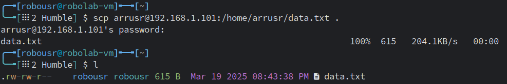

# Uso de SSH para conectarse a un dispositivo en una Red Local

En **ROS 2**, muchas aplicaciones requieren la conexión remota a un robot para ejecutar nodos, monitorear procesos o depurar errores. Una de las formas más eficientes y seguras de acceder a un robot en una red local es mediante **SSH (Secure Shell)**.  

SSH permite controlar un dispositivo de forma remota a través de una conexión segura, lo que es especialmente útil cuando el robot no tiene una pantalla o teclado, como en el caso de sistemas embebidos (por ejemplo, una **Jetson Nano ejecutando ROS 2**).  

## ¿Por qué usar SSH?  

- **Acceso remoto seguro:** SSH cifra la comunicación, evitando que terceros intercepten comandos o credenciales.  
- **Ejecución de nodos ROS 2 desde otra máquina:** Se pueden lanzar nodos en el robot desde una computadora de control.  
- **Transferencia de archivos entre el host y el robot:** Es posible enviar scripts o configuraciones necesarias para ROS 2.  
- **Monitoreo y depuración en tiempo real:** Se pueden visualizar logs y ejecutar herramientas de diagnóstico sin estar físicamente presente.  

**Ejemplo de aplicación**:  
- Un investigador está en su computadora (**hostname: robolab-vm**, **IP: 192.168.1.106**) y necesita conectarse al robot (**hostname: arrg-dev01**, **IP: 192.168.1.101**, usuario: `arrusr`) para ejecutar nodos de ROS 2.  

## Conexión a un Robot con SSH

Para establecer la conexión SSH, en la terminal del host (**robolab-vm**), ejecuta:  

```bash
ssh arrusr@192.168.1.101
```

**Salida esperada en la primera conexión**:  

```console
The authenticity of host '192.168.1.101 (192.168.1.101)' can't be established.
ECDSA key fingerprint is SHA256:abc123xyz456...
Are you sure you want to continue connecting (yes/no)? yes
```

Tras aceptar la conexión (`yes`), se pedirá la contraseña del usuario **arrusr**.  

**Si la conexión es exitosa, la terminal cambiará a la del robot:**  

```console
arrusr@arrg-dev01:~$
```
Ahora puedes ejecutar comandos en el robot de forma remota.  


## Ejecutar Nodos ROS 2 en el Robot desde SSH**  

Una vez conectado al robot (**arrg-dev01**), puedes iniciar ROS 2 y lanzar nodos.  

**Ejemplo**: Ejecutar un nodo ROS 2 en el robot

```bash
source /opt/ros/humble/setup.bash
ros2 run demo_nodes_cpp talker
```
**Ejemplo**: Verificar los nodos activos en la red

```bash
ros2 node list
```

**Si otros nodos están corriendo en la red (por ejemplo, en `robolab-vm`), deberían aparecer en la lista**.  

Si la conexión falla, verifica:  
- Que ambos dispositivos estén en la misma red (`ping 192.168.1.101`).  
- Que el servicio SSH esté corriendo en el robot (`sudo systemctl status ssh`).  
- Que el puerto 22 esté abierto en el firewall (`sudo ufw allow 22/tcp`).  

## Conexión SSH sin contraseña con claves SSH

Para evitar ingresar la contraseña en cada conexión, se pueden generar **claves SSH** en el host (**robolab-vm**) y transferirlas al robot (**arrg-dev01**).  

**Generar la clave SSH en `robolab-vm`**  

```bash
ssh-keygen -t rsa -b 4096
```

**Presionar Enter en todas las preguntas** para aceptar los valores predeterminados.  

**Copiar la clave al robot (`arrg-dev01`)**  

```bash
ssh-copy-id arrusr@192.168.1.101
```

Se pedirá la contraseña solo esta vez.  

**Verificar la conexión sin contraseña**  

```bash
ssh arrusr@192.168.1.101
```

Ahora la conexión SSH será automática.  

## Transferencia de Archivos entre el Host y el Robot

Para copiar archivos entre el **host (`robolab-vm`)** y el **robot (`arrg-dev01`)**, se usa `scp` o `rsync`.  

**Ejemplo**: Transferir un script desde `robolab-vm` al robot

```bash
scp mi_script.py arrusr@192.168.1.101:/home/arrusr/
```


**Ejemplo**: Transferir un archivo desde el robot al host

```bash
scp arrusr@192.168.1.101:/home/arrusr/datos.txt .
```



Para copiar carpetas grandes de forma eficiente, usa `rsync`:  

```bash
rsync -avz /path/local/ arrusr@192.168.1.101:/path/remoto/
```

## Uso Avanzado: Ejecutar ROS 2 desde SSH sin Sesión Activa

Si se necesita ejecutar ROS 2 en el robot sin mantener la conexión abierta, se pueden usar los siguientes métodos:  

**Ejecutar un nodo en segundo plano**

```bash
nohup ros2 run demo_nodes_cpp talker > output.log 2>&1 &
```

**Usar `tmux` o `screen` para sesiones persistentes**

```bash
tmux new -s ros_session
ros2 run demo_nodes_cpp talker
```

Luego, se puede desconectar de `tmux` con `Ctrl + B` y `D`, dejando el nodo corriendo.  

## Solución de Problemas en SSH y ROS 2 Networking

| **Problema** | **Posible Solución** |
|-------------|----------------------|
| `ssh: connection refused` | Verificar que SSH esté activo en el robot (`sudo systemctl start ssh`). |
| `ssh: No route to host` | Asegurar que el robot esté en la misma red (`ping 192.168.1.101`). |
| No se ven nodos ROS 2 tras conectarse | Configurar el mismo `ROS_DOMAIN_ID` en ambos dispositivos. |
| `scp` falla | Verificar permisos de escritura en la carpeta de destino. |
| SSH lento en conexión | Editar `/etc/ssh/sshd_config` y desactivar `UseDNS`. |
