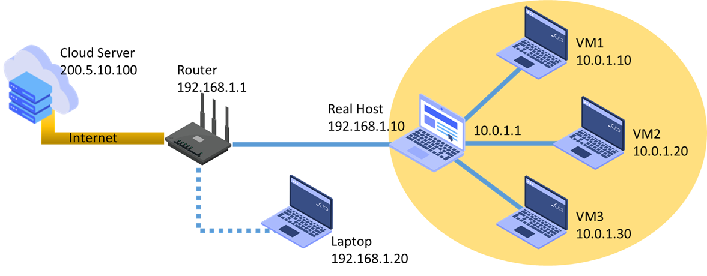
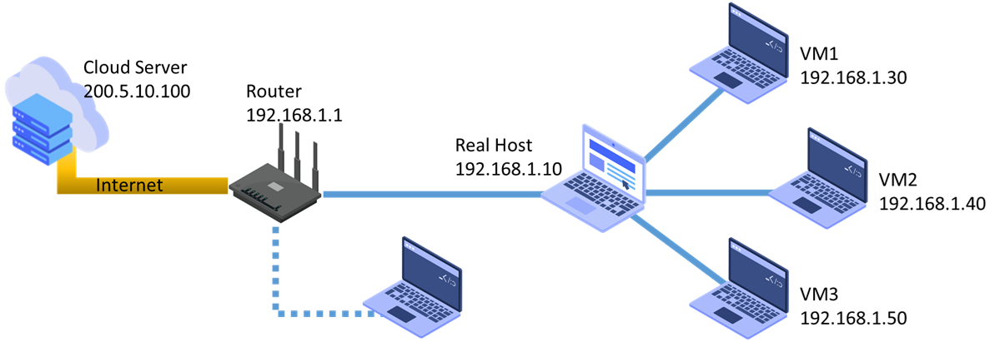
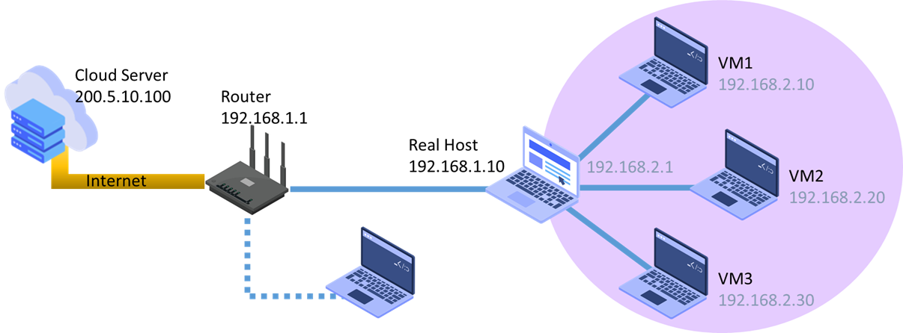

# Consideraciones para Comunicar una Máquina Virtual con Dispositivos en una Red Local en ROS 2

Cuando se utiliza una **Máquina Virtual (VM)** para ejecutar **ROS 2** y se necesita establecer comunicación con otros dispositivos en una red local, se deben considerar diversos factores relacionados con la configuración de la red, el descubrimiento de nodos y la compatibilidad del middleware. A continuación, se describen las principales consideraciones para garantizar una comunicación eficiente.  


## Configuración de Red de la Máquina Virtual

La manera en que la máquina virtual accede a la red es crucial para permitir la comunicación con otros dispositivos. Existen varias opciones de configuración de red en software de virtualización como **VirtualBox**, **VMware** o **QEMU/KVM**:  

### Modo NAT (Network Address Translation)

La VM tiene acceso a internet, pero se encuentra en una subred separada del sistema anfitrión y otros dispositivos de la red local.  

**Ventajas:**  
- Fácil de configurar, ya que la VM obtiene una dirección IP privada y usa la del anfitrión para salir a internet.  

**Desventajas:**  
- No permite comunicación directa con otros dispositivos en la red local.  
- No es recomendable para ROS 2, ya que el descubrimiento de nodos fallará.  

**Conclusión:** Modo **NO recomendado** para comunicación en ROS 2.



### Modo Bridge (Puente de Red)

La VM obtiene una dirección IP en la misma subred que el sistema anfitrión y otros dispositivos de la red local.  

**Ventajas:**  
- La VM puede comunicarse directamente con otros dispositivos de la red, incluidos otros nodos ROS 2.  
- Permite el descubrimiento automático de nodos mediante **multicast**.  

**Desventajas:**  
- Puede requerir configuraciones adicionales en redes con restricciones de seguridad (firewalls, políticas de red).  

**Conclusión:** Modo **altamente recomendado** para ROS 2.



### Modo Red Interna (Host-Only)

La VM solo se comunica con el sistema anfitrión y otras VMs en la misma configuración de red interna.  

**Ventajas:**  
- Útil para pruebas locales sin acceso a internet.  

**Desventajas:**  
- No permite comunicación con otros dispositivos de la red local.  

**Conclusión:** Modo **útil solo para pruebas locales**, pero **no recomendado para redes ROS 2 distribuidas**.  



## Configuración del Middleware DDS en ROS 2

ROS 2 utiliza **DDS (Data Distribution Service)** para la comunicación entre nodos. DDS requiere el uso de **descubrimiento automático** y multicast, lo que puede verse afectado en una máquina virtual.  

### Configuraciones necesarias para compatibilidad con VMs

**Definir el `ROS_DOMAIN_ID`** para evitar conflictos con otras instancias de ROS 2:  

```bash
export ROS_DOMAIN_ID=10
```

**Habilitar multicast en la VM** si el proveedor de red lo bloquea. Algunos entornos pueden requerir configuración manual en **iptables o firewalls**.  

**Configurar la implementación de DDS adecuada:**  
Dependiendo de la implementación de DDS utilizada en ROS 2 (Fast DDS, Cyclone DDS, Connext DDS), pueden ser necesarias configuraciones adicionales para permitir la comunicación entre la VM y la red local.  

Ejemplo de configuración para **Fast DDS** (`FASTRTPS_DEFAULT_PROFILES.xml`):  

```xml
<transport_descriptors>
    <transport_descriptor>
        <transport_id>udp_transport</transport_id>
        <type>UDPv4</type>
    </transport_descriptor>
</transport_descriptors>
```

---

## Consideraciones Adicionales**  

**Abrir puertos en el firewall de la VM y el sistema anfitrión**  
Si hay problemas de conexión, se debe verificar que los **puertos dinámicos de DDS** estén abiertos en el firewall.  

```bash
sudo ufw allow 7400:7500/udp
```

**Verificar la conectividad con `ping` y `ros2 multicast send`**  
Para comprobar que la VM puede comunicarse con otros dispositivos en la red, se puede usar:  

```bash
ping <IP_DE_OTRO_NODO>
ros2 multicast send
ros2 multicast receive
```

**Utilizar `ros2 daemon` si hay retrasos en el descubrimiento de nodos**  
Si los nodos tardan en detectarse, reiniciar el daemon puede ayudar:

```bash
ros2 daemon stop
ros2 daemon start
```